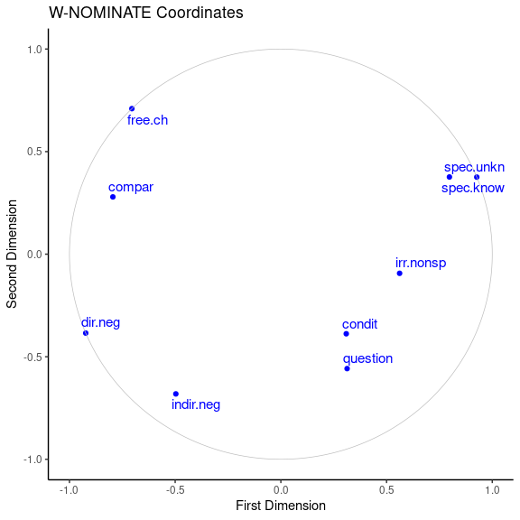
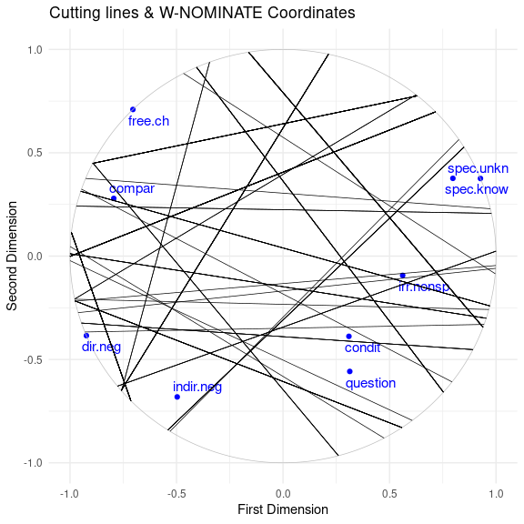

## MDS for Linguists

**An R-based guide for linguistic typologists** interested in applying
[NOMINATE](https://voteview.com/about) multidimensional scaling (MDS)
techniques to linguistic data as presented in
[Croft](http://www.unm.edu/~wcroft/) and
[Poole](https://polisci.ucsd.edu/about-our-people/faculty/faculty-directory/emeriti-faculty/poole-profile.html),
“Inferring universals from grammatical variation: multidimensional
scaling for typological analysis” (*Theoretical Linguistics* 34.1-37,
2008).”
[\[Abstract\]](https://www.degruyter.com/view/j/thli.2008.34.issue-1/thli.2008.001/thli.2008.001.xml)

This guide provides a brief summary of an R-based workflow for model
implementation and the visualization of model results within the
`ggplot` data visualization framework. A cross-linguistic data set of
indefinite pronouns from Haspelmath (1997) is utilized (and made
available) here for demonstration purposes. For more thoughtful
discussions regarding theory, scaling procedures & model interpretation,
see reference section.

-   [Getting started](#getting-started)
    -   [Install and load required
        packages](#install-and-load-required-packages)
    -   [Load data](#load-data)
-   [Using `wnominate` & `pscl`](#using-%60wnominate%60-&-%60pscl%60)
    -   [Building MDS models](#building-mds-models)
    -   [Visualizing model results](#visualizing-model-results)
    -   [Cutting lines and roll call polarity via
        wnomadds](#cutting-lines-and-roll-call-polarity-via-wnomadds)
    -   [Facet cutting lines by
        language](#facet-cutting-lines-by-language)
-   [References](#references)

## Getting started

### Install and load required packages

``` r
if (!require("pacman")) install.packages("pacman")
pacman::p_load(# anominate, -- no longer maintained -- 
               wnominate, 
               pscl, 
               ggplot2, 
               knitr, 
               devtools, 
               ggrepel, 
               data.table)
```

``` r
devtools::install_github("jaytimm/wnomadds")
library(wnomadds)
```

### Load data

Data set: A 9 x 140 data frame: Nine indefinite pronominal meanings,
using data from 140 pronouns in 40 languages. Data are made available
[here](https://github.com/jaytimm/mds_for_linguists_using_R/blob/master/resources/Indefprn13.txt).

``` r
## File paths will look differently for Windows/Mac
local_data <- '/home/jtimm/Desktop/data/'
```

Load data set:

``` r
setwd(local_data)
raw_data <- read.csv("Indefprn13.txt",
            sep="\t", 
            stringsAsFactors = FALSE)
```

A portion of the data frame is presented below. Rows contain
functions/meanings, and are analagous to legislators in the NOMINATE
model. Columns contain language-specific grammatical forms, and are
analagous to roll calls (ie, votes) in the NOMINATE model.

A value of 1 in the table below means that a given form expresses a
particular meaning; a value of 6 means that a given form does not
express that particular meaning. Missing data are specified with the
value 9.

``` r
knitr::kable(raw_data[,1:9]) 
```

| X         | X01n | X01e | X01i | X01j | X01jd | X02d | X02e | X02i |
|:----------|-----:|-----:|-----:|-----:|------:|-----:|-----:|-----:|
| spec.know |    6 |    1 |    6 |    6 |     6 |    6 |    6 |    1 |
| spec.unkn |    6 |    1 |    1 |    6 |     6 |    6 |    6 |    1 |
| irr.nonsp |    6 |    1 |    1 |    6 |     6 |    1 |    6 |    1 |
| question  |    6 |    1 |    1 |    1 |     6 |    1 |    1 |    1 |
| condit    |    6 |    1 |    1 |    1 |     6 |    1 |    1 |    1 |
| indir.neg |    6 |    1 |    1 |    1 |     1 |    1 |    1 |    1 |
| compar    |    6 |    6 |    1 |    1 |     1 |    1 |    1 |    6 |
| dir.neg   |    1 |    6 |    6 |    6 |     6 |    6 |    6 |    6 |
| free.ch   |    6 |    6 |    1 |    6 |     1 |    1 |    6 |    6 |

------------------------------------------------------------------------

## Using `wnominate` & `pscl`

### Building MDS models

#### Rollcall object

The first step is to transform the original data structure into a
`rollcall` object using the `pscl` package.

``` r
roll_obj <- pscl::rollcall(raw_data [,-1], 
                           yea=1, 
                           nay=6, 
                           missing=9,
                           notInLegis=8,
                           vote.names = colnames(raw_data)[2:ncol(raw_data)], 
                           legis.names = raw_data[,1])
```

#### Ideal points estimation

Then we fit three models using the `wnominate` function – one-, two- &
three-dimensional solutions.

``` r
ideal_points_1D <- wnominate::wnominate (roll_obj, dims = 1, polarity=c(1)) 
ideal_points_2D <- wnominate::wnominate (roll_obj, dims = 2, polarity=c(1,2)) 
ideal_points_3D <- wnominate::wnominate (roll_obj, dims = 3, polarity=c(1,2,3)) 
```

The resulting data structures are each comprised of seven elements:

``` r
names(ideal_points_1D)
```

    ## [1] "legislators" "rollcalls"   "dimensions"  "eigenvalues" "beta"       
    ## [6] "weights"     "fits"

#### Model comparison and fitness statistics

Correct classification and fitness statistics for each model are
extracted from the `fits` element, and summarized below:

``` r
list('1D' = ideal_points_1D$fits, 
     '2D' = ideal_points_2D$fits, 
     '3D' = ideal_points_3D$fits)
```

    ## $`1D`
    ## correctclass1D         apre1D          gmp1D 
    ##      86.559998       0.539726       0.756875 
    ## 
    ## $`2D`
    ## correctclass1D correctclass2D         apre1D         apre2D          gmp1D 
    ##     86.3199997     93.1999969      0.5315068      0.7671233      0.7596588 
    ##          gmp2D 
    ##      0.8530398 
    ## 
    ## $`3D`
    ## correctclass1D correctclass2D correctclass3D         apre1D         apre2D 
    ##     85.5999985     94.8800049     95.4400024      0.5068493      0.8246576 
    ##         apre3D          gmp1D          gmp2D          gmp3D 
    ##      0.8438356      0.7662863      0.8526035      0.9352897

### Visualizing model results

#### A one-dimensional solution

Extract legislator coordinates (ie, ideal points) from one-dimensional
model results.

``` r
d1 <- cbind(label=rownames(ideal_points_1D$legislators), 
            ideal_points_1D$legislators)
d1 <- d1[order(d1$coord1D),]
```

Plot legislators (ie, grammatical functions) in one-dimensional space by
rank.

``` r
ggplot()  +
  geom_text(data = d1,
            aes(x=reorder(label, coord1D), 
                y=coord1D, 
                label=label), 
            size=4, 
            color = 'blue') +
  
#  theme_classic() +
   theme_minimal() +
  
  labs(title="1D W-NOMINATE Plot") + 
  theme(axis.text.y=element_blank(),
        axis.ticks.y=element_blank())+ 
  xlab('') + ylab('First Dimension')+
  ylim(-1.1, 1.1)+
  coord_flip()
```


#### A two-dimensional solution

We first build a simple “base” plot using legislator coordinates from
two-dimensional model results. Per `wnominate` convention, we add a unit
circle to specify model constraints. All subsequent plots are built on
this simple base plot.

``` r
base_2D <- ggplot(data = ideal_points_2D$legislators,
       aes(x=coord1D, 
           y=coord2D)) +
  
  geom_point(size= 1.5,
             color = 'blue') +
  
  annotate("path",
           x=cos(seq(0,2*pi,length.out=300)),
           y=sin(seq(0,2*pi,length.out=300)),
           color='gray',
           size = .25) +
  
  xlab('First Dimension') + 
  ylab('Second Dimension') 

base_2D + ggtitle('Two-dimensional base plot')
```


**Add** labels, a title, and change the theme.

``` r
base_2D +

  ggrepel::geom_text_repel(
    data  = ideal_points_2D$legislators,
    aes(label = rownames(ideal_points_2D$legislators)),
    direction = "y",
    hjust = 0, 
    size = 4,
    color = 'blue') +
  
  theme_classic() +
# theme_minimal() +
  
  ggtitle("W-NOMINATE Coordinates") 
```



------------------------------------------------------------------------

### Cutting lines and roll call polarity via wnomadds

I have developed a simple R package, `wnomadds`, that facilitates the
plotting of roll call cutting lines and roll call polarities using
`ggplot`. While `wnominate` provides functionality for plotting cutting
lines, only plotting in base R is supported. The `wnm_get_cutlines`
function extracts cutting line coordinates from `wnominate` model
results, along with coordinates specifying the direction of majority Yea
votes for a given roll call (ie, vote polarity). Addtional details about
the package are available [here](https://github.com/jaytimm/wnomadds).

``` r
with_cuts <- wnomadds::wnm_get_cutlines(ideal_points_2D, 
                                        rollcall_obj = roll_obj, 
                                        arrow_length = 0.05)
```

A sample of the resulting data frame:

``` r
head(with_cuts)
```

    ##    Bill_Code        x_1         y_1        x_2         y_2       x_1a
    ## 1:      X01e  0.2133632  0.97697296 -0.7595687 -0.65042705  0.2947332
    ## 2:      X01j  0.9537808 -0.30050308 -0.9999306  0.01178267  0.9693951
    ## 3:     X01jd -0.3446922  0.93871577 -0.7581260 -0.65210812 -0.4242334
    ## 4:      X01n -0.7141289 -0.70001426 -0.9934111  0.11460499 -0.6733979
    ## 5:      X02d  0.9963522 -0.08533627 -0.4672491  0.88412571  0.9478791
    ## 6:      X02e  0.9537808 -0.30050308 -0.9999306  0.01178267  0.9693951
    ##          y_1a       x_2a       y_2a
    ## 1:  0.9283264 -0.6781987 -0.6990736
    ## 2: -0.2028175 -0.9843163  0.1094682
    ## 3:  0.9593875 -0.8376672 -0.6314364
    ## 4: -0.6860501 -0.9526802  0.1285691
    ## 5: -0.1585163 -0.5157222  0.8109456
    ## 6: -0.2028175 -0.9843163  0.1094682

#### Cutting lines & legislator coordinates

``` r
base_2D +

  ggrepel::geom_text_repel(
    data  = ideal_points_2D$legislators,
    aes(label = rownames(ideal_points_2D$legislators)),
    direction = "y",
    hjust = 0, 
    size = 4,
    color = 'blue') +
  
  geom_segment(data = with_cuts, 
               aes(x = x_1, y = y_1, 
                   xend = x_2, yend = y_2),
               size = .25) + #cutting start to end
  
  theme_minimal() +
  labs(title="Cutting lines & W-NOMINATE Coordinates")
```



#### Cutting lines, roll call polarity & legislator coordinates

``` r
base_2D +
  
  geom_segment(data=with_cuts, 
               aes(x = x_1, y = y_1, 
                   xend = x_2, yend = y_2),
               size = .25) + #cutting start to end
  
  ##ARROWS -- 
  geom_segment(data=with_cuts, 
               aes(x = x_2, y = y_2, 
                   xend = x_2a, yend = y_2a), 
               #cutting end to opposite arrow
               color = 'red',
               arrow = arrow(length = unit(0.2,"cm"))) +
  
  geom_segment(data=with_cuts, 
               aes(x = x_1, y = y_1, 
                   xend = x_1a, yend = y_1a), 
               #cutting start to opposite arrow
               color = 'red',
               arrow = arrow(length = unit(0.2,"cm")))+ 
  ##END ARROWS.
  
  geom_text(data=with_cuts, 
               aes(x = x_1a, y = y_1a, 
                   label = Bill_Code), 
               size=2.5, 
               nudge_y = 0.03,
               check_overlap = TRUE) +

  theme_minimal() +
  labs(title = "W-NOMINATE Coordinates, cutting lines & roll call polarity")
```


#### Selected cutting lines and legislator coordinates

``` r
selected <- c('X01e', 'X01j', 'X01jd', 'X01n')

subset_cuts <- subset(with_cuts, Bill_Code %in% selected)

base_2D +
  
  ggrepel::geom_text_repel(
    data  = ideal_points_2D$legislators,
    aes(label = rownames(ideal_points_2D$legislators)),
    direction = "y",
    hjust = 0, 
    size = 4,
    color = 'blue') +
  
  geom_segment(data=subset_cuts, 
               aes(x = x_1, y = y_1, 
                   xend = x_2, yend = y_2),
               size = .25) + #cutting start to end
  
  ##ARROWS -- 
  geom_segment(data=subset_cuts, 
               aes(x = x_2, y = y_2, 
                   xend = x_2a, yend = y_2a), 
               #cutting end to opposite arrow
               color = 'red',
               arrow = arrow(length = unit(0.2,"cm"))) +
  
  geom_segment(data=subset_cuts, 
               aes(x = x_1, y = y_1, 
                   xend = x_1a, yend = y_1a), 
               #cutting start to opposite arrow
               color = 'red',
               arrow = arrow(length = unit(0.2,"cm")))+ 
  ##END ARROWS.
  
  geom_text(data=subset_cuts, 
               aes(x = x_1a, y = y_1a, 
                   label = Bill_Code), 
               size=2.5, 
               nudge_y = 0.03,
               check_overlap = TRUE) +

  theme_minimal() +
  labs(title = "W-NOMINATE Coordinates & selected cutting lines")
```


### Facet cutting lines by language

``` r
#Extract language code from language-specific grammatical forms
with_cuts$lang <- gsub('[A-Za-z]', '', with_cuts$Bill_Code)

#Filter cutting line data set to first six language codes.
facet_cuts <- subset(with_cuts, lang %in% c('01', '02', '03', '04', '05', '06'))

base_2D +
  
  geom_segment(data=facet_cuts, 
               aes(x = x_1, y = y_1, 
                   xend = x_2, yend = y_2),
               size = .25) + #cutting start to end
  
  ##ARROWS -- 
  geom_segment(data=facet_cuts, 
               aes(x = x_2, y = y_2, 
                   xend = x_2a, yend = y_2a), 
               #cutting end to opposite arrow
               color = 'red',
               arrow = arrow(length = unit(0.2,"cm"))) +
  
  geom_segment(data=facet_cuts, 
               aes(x = x_1, y = y_1, 
                   xend = x_1a, yend = y_1a), 
               #cutting start to opposite arrow
               color = 'red',
               arrow = arrow(length = unit(0.2,"cm")))+ 
  ##END ARROWS.

  theme_minimal() +
  facet_wrap(~lang) +
  coord_fixed()+
  labs(title = "W-NOMINATE Coordinates & language-specific cutting lines")
```


------------------------------------------------------------------------

## References

Royce Carroll, Christopher Hare, Jeffrey B. Lewis, James Lo, Keith T.
Poole and Howard Rosenthal (2017). Alpha-NOMINATE: Ideal Point
Estimator. R package version 0.6. URL <http://k7moa.c>
om/alphanominate.htm

Croft, W., & Poole, K. T. (2008). Inferring universals from grammatical
variation: Multidimensional scaling for typological analysis.
*Theoretical linguistics*, 34(1), 1-37.

Haspelmath, M. (1997). *Indefinite pronouns*. Oxford: Clarendon Press.

Poole, K. T. (2005). *Spatial models of parliamentary voting*. Cambridge
University Press.

Keith Poole, Jeffrey Lewis, James Lo, Royce Carroll (2011). Scaling Roll
Call Votes with wnominate in R. *Journal of Statistical Software*,
42(14), 1-21. URL <http://www.jstatsoft.org/v42/i14/>.
